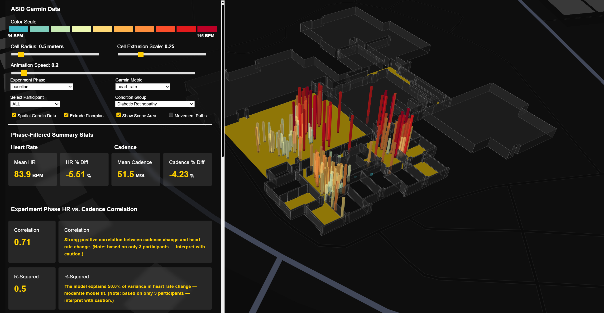

# ASID - Garmin Data

## Physiological data collected using Garmin Vivosmart-4 wearables

This repository contains the physiological data collected using Garmin wearable
devices in support of a broader research study. The dataset underpins the
associated analysis, report, and visualization application by providing
objective biometric measurements (e.g., heart rate and cadence) captured during
the experiments.

Both raw device outputs (e.g., .FIT, .GPX) and processed, analysis-ready
datasets are included. The processed data reflects the transformation and
synchronization pipeline used to align physiological and spatial records for
downstream analysis and visualization.

## Use the web app to explore the data

  

**Link:** [ASID Garmin Data App](https://asid-garmin-viz.vercel.app/)
